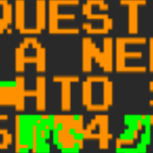

    

# LunarROMCorruptor

## Corrupt any file using multiple different ‘Engines’

## Features

### Corrupt Every Nth Byte and Intensity Mode
Corrupt Every Nth Byte allows for a more "regular" corruption. (e.g. corrupt every 1st byte corrupts the entire file)
Intensity allows for a more randomized corruption by selecting random addresses to corrupt.

### File Saves and Stash Saves
When you have found the perfect corruption, you can use both the File Save and the Stash Save features.
File save copies the corrupted file and stores it in the "Saves" directory.

Stash saves are different. Instead of saving the whole file, instead, it saves the address of the changed byte and what the byte value is now. Which takes up less file size.
Also using the stash editor, if you find that a certain corruption changes the color of Mario, you can remove bytes one at a time until you find the corrupted byte that causes it, then you can go nuts with that byte. (Similar to how the Stash Saves and Editor works on the Windows Glitch Harvester)

### Engines
Here are the following engines that come with LunarROMCorruptor
 - Nightmare Engine:

   A simple, yet effective way of corrupting files, with three corruption modes: RANDOM, RANDOMTILT and TILT.

    -RANDOM

     The selected byte gets set with a random value of 0 to 255

    -RANDOMTILT

     The selected byte gets set with a random value of 0 to 255 or a user specified value gets added/subtracted from the byte.

    -TILT

     The selected byte will have its value added or subtracted by a user specified value. (e.g. 255 - 3, 242 + 1)

 - Merge Engine

   An engine that copies bytes from one file to the other to create corruption (For example, 'merging' Super Mario Bros. with Donkey Kong).
 - Logic Engine

   An engine that uses bitwise/logical operations on two selected bytes.
 - Lerp Engine

   An engine that takes the 2 neighbouring bytes where the selected byte is and corrupts the selected byte by using linear interpolation
   (e.g. 0 21 100 would become 0 50 100 if the Lerp Setting was set to 0.5)
 - Vector2 Engine (Not finished)
 - Manual (User manually enables and sets what types of corruption takes place in the file.)

### Misc
- With more engines and settings to play around with, the more interesting results you can get with the engines.
- Allows drag and drop. No need to search for the file you want to corrupt.
- Can run an emulator after corruption.
- Audible feedback when corruption is done.

## Progress
- [x] Import GUI from the old project
- [x] Fully convert the VB.NET code from the old project and convert to C#
- [x] Do bug testing
- [x] Code Refactoring (Optimize the engines, code cleanup, etc)

## About
This project started around 2019 and was originally made in VB.NET. I was fascinated by other corruptors and wanted to make my own. The project was finished in the same year, but since the code was very messy, I decided not to release it.

A year later, I decided to remake it in C#, mainly because I want to teach myself more C#, but also to do some code refactoring to make it more optimized.

LunarROMCorruptor uses engines to corrupt files, each engine has its usage and its own settings that can be changed.
I've included the Nightmare Engine, which is an engine from the Windows Glitch Harvester, into the project so that people that are most familiar with that engine can use it.

### Requirements
.NET Framework 4.7.2 is required to run the program.
For development, Microsoft Visual Studio Community 2019 is recommended.
## Contributing
Pull requests are welcome. Major and minor.
## Notes
Active development is in the unstable branch of this repo. The master branch is for stable updates.

## License
[MIT](https://choosealicense.com/licenses/mit/)

## Corruption Warning
- This program can irreversibly corrupt personal or critical system data if you're not careful.
- This program comes with no warranty of ANY kind and is provided 'AS IS'.
- You're responsible for backing up your data before use and for any damage that comes with the use or misuse of this program.
- Anti-cheat software may be triggered if corruption is used on multiplayer games.
