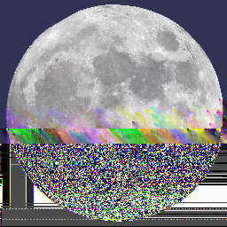

    

# LunarROMCorruptor

## Corrupt any file(s) (not just ROMs!) using multiple different engines

## Features

### Corrupt the way **you** want to
Tailor your corruption to perfection with this versatile corruptor. With countless customization options, you have complete control over how the corruptor operates, allowing you to achieve the perfect level of corruption every time.

### Corrupt Every Nth Byte and Intensity Mode
With Corrupt Every Nth Byte, you can apply regular corruptions to your file by specifying the interval to corrupt (e.g., every 1st byte, every 2nd byte, etc.). On the other hand, Intensity allows for randomized corruptions, where the corruptor selects random addresses to modify.

### File Saves and Stash Saves
After you've found the perfect corruption, you can choose to save your progress using either the File Save or the Stash Save features. The File Save option makes a copy of the entire corrupted file and stores it in the 'Saves' directory.

On the other hand, the Stash Save feature saves only the addresses of the changed bytes and their new values, which takes up less space. In addition to the Stash Save, there's a stash editor that allows you to fine-tune the corrupted bytes and addresses to achieve the desired effect.

For instance, let's say there's a corruption that alters the color of Mario in Super Mario Bros but crashes the game when you try to start it. You can use the stash editor to remove the bytes that cause the crash and retain the byte responsible for changing the color. This functionality is similar to how the Stash Saves and Editor work on the Windows Glitch Harvester.

### Corrupt multiple files
Not only can you corrupt just a ROM or a singular program, you can use this corruptor to corrupt several files or even select an entire folder of files to corrupt.

### Engines
Here are the following engines that come with LunarROMCorruptor
 - Nightmare Engine:

   A simple, yet effective way of corrupting files, with three corruption modes: RANDOM, RANDOMTILT and TILT.

    -RANDOM

     The selected byte gets set with a random value of 0 to 255.

    -RANDOMTILT

     The selected byte gets set with a random value of 0 to 255 or a user specified value gets added/subtracted from the byte.

    -TILT

     The selected byte will have its value added or subtracted by a user specified value. (e.g. 255 - 3, 242 + 1)

 - Merge Engine

   An engine that copies bytes from one file to the other to create corruption (For example, 'merging' bytes from Super Mario Bros. with Donkey Kong bytes).
 - Logic Engine

   An engine that uses bitwise/logical operations on two selected bytes.
   
        AND
        OR
        XOR
        NOT
        NAND
        NOR
        SWAP
        SHIFT
   
 - Lerp Engine

   An engine that takes the 2 neighbouring bytes where the selected byte is and corrupts the selected byte by using linear interpolation
   (e.g. 0 21 100 would become 0 50 100 if the Lerp Setting was set to 0.5)
 - Manual (User manually enables and sets what types of corruption takes place in the file.)

### Misc
- With more engines and settings to play around with, the more interesting results you can get with the engines.
- Allows drag and drop. No need to search for the file you want to corrupt.
- Can run an emulator after corruption.
- Audible feedback when corruption is done.
- Corrupt multiple files.
- Saves settings

## Progress
- [x] Import GUI from the old project
- [x] Fully convert the VB.NET code from the old project and convert to C#
- [x] Do bug testing
- [x] Code Refactoring (Optimize the engines, code cleanup, etc)

## About
This project started around 2019 and was originally made in VB.NET. I was fascinated by other corruptors and wanted to make my own. The project was finished in the same year, but since the code was very messy, I decided not to release it.

A year later, I decided to remake it in C#, mainly because I want to teach myself more C#, but also to do some code refactoring to make it more optimized.

LunarROMCorruptor uses engines to corrupt files, each engine has its usage and its own settings that can be changed.
I've included the Nightmare Engine, which is an engine from the Windows Glitch Harvester, into the project so that people that are most familiar with that engine can use it.

### Requirements
.NET Framework 4.7.2 is required to run the program.
For development, Microsoft Visual Studio Community 2019 is recommended.
## Contributing
Pull requests are welcome. Major and minor.
## Notes
Active development is in the unstable branch of this repo. The master branch is for stable updates.

## License
[MIT](https://choosealicense.com/licenses/mit/)

## Corruption Warning
- If you have epilepsy, it is advisable to refrain from participating in corruption activities, due to the flashing imagery that may occur with corruptions.
- When corrupting specific games, there's a remote possibility of encountering a Blue Screen of Death (BSOD). Although BSOD occurrences are infrequent and generally don't cause major harm to your computer, they - will prompt an automatic restart. Always ensure you save any ongoing work before engaging in corruption to avoid data loss.
- Using this corruptor in online games or those protected by anti-cheat software may result in account bans. Additionally, refrain from corrupting essential system files, such as system32, as it can lead to irreversible damage to - personal or critical system data. If you really want to, do it in a virutal machine to minimize potential risks.
- It is essential to recognize that this program comes with no warranties of any kind and is provided "AS IS." Users are personally responsible for backing up their data before use and for any consequences arising from the appropriate - or inappropriate use of the program. Refrain from corrupting multiplayer game files, as anti-cheat software may be triggered.